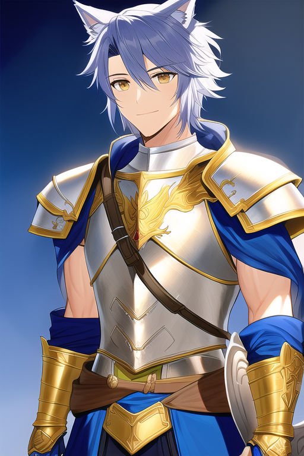
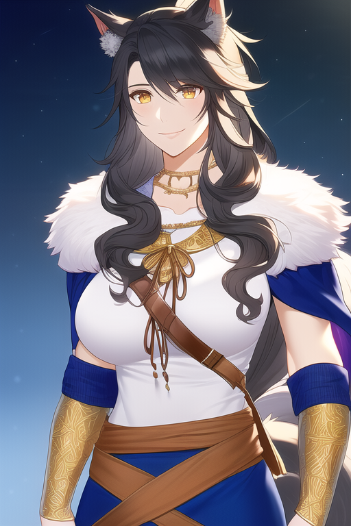
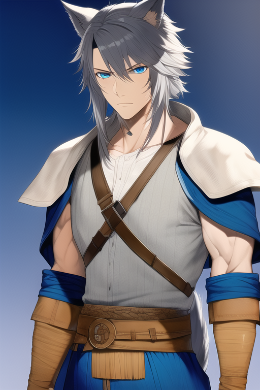
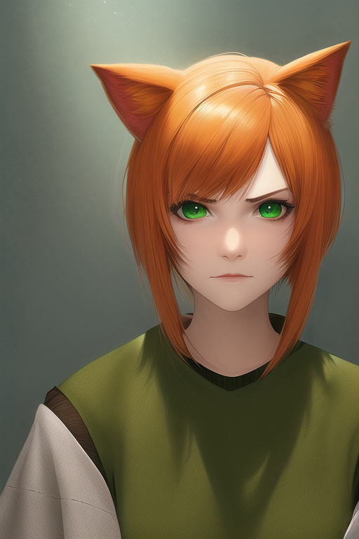
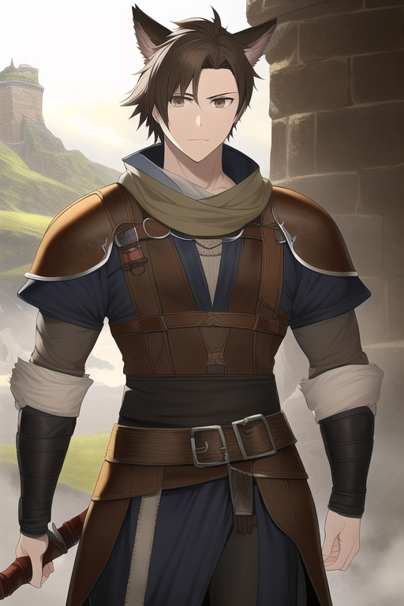
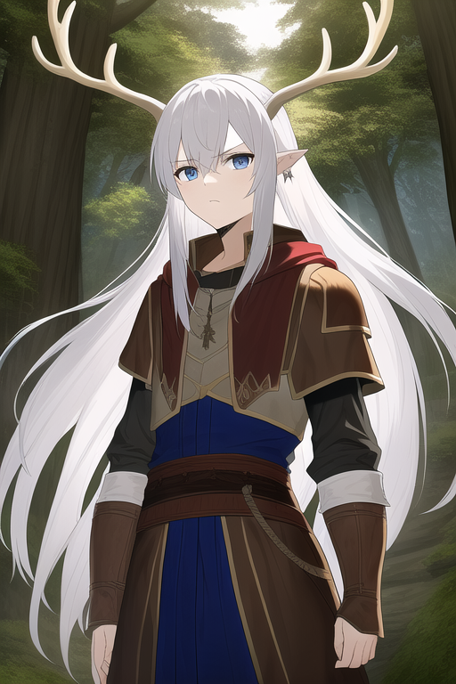

# Backstory

Bullied and picked on as a child, Jet never forgot the words of his parent's:
"In all things you do, do it with passion". With these words in mind he took
each insult in stride, claiming it would only better his story and his fame in
the end. When he was old enough he applied to be a city guard, going through
training and learning swordplay and various techniques. After a year of guard
duty though he realized it wasn't the life that was calling him and he left to
become a mercenary, looking to make a name for himself and maybe those who chose
to travel with him.

His overly friendly and can do attitude stems from years and years of rejection
and loneliness. Every friend he's tried to make and maintain has left him. His
goal of becoming legendary/story worthy is to help him make friends. The thought
"maybe if I'm a legend I'll have friends then". He's quick to call everyone a
friend, but it's very used to Grimlock's attitude towards him

The only consistent people in his life have been his parents. They're the ones
who already told him the stories of legends and those that surrounded them.

When Jet set off to become a hero, Gabriel told him to "Not come back until we
know your name". When Jet left, he left his last name, his tribe name, behind,
which is why he just goes by Jet. It's also the other reason he hasn't made his
way back to see his parents even though it's been a few years, he feels he
hasn't achieved his goal, and he'd bring shame upon himself if he were to go
back

## Portrait

# Relationship with Parents

Alma was incredibly supportive of her "shining son". She was the one who usually
told him the stories of legends as he was growing up. But, she was also not
usually a fighter, staying in the village and helping around with cooking meals
or possibly gathering some herbs and fibers for medicinal use or making clothes.

Gabriel was proud of Jet, trained him in combat, and would take him out hunting
when time permitted, he's the reason Jet knows how to fight and fight well.
Always taught him that protection, defense, was the best way to win in the long
run. Patience would reward those who can show it. He was also the most critical
of Jet when it came to both his combat training, and to the decision to leave
the tribe. Gabriel had planned for Jet to take over the helm so he could stay
with Alma more, so there was some disappointment when Jet decided leave, but
there was a great amount of pride as well for is son blazing his own path.

## Alma

## Gabriel

# Bullies

Tory (the orange hair cat) had a very snarky and aggressive personality towards
Jet, teasing him about his unnatural blue hair, being extra aggressive in
sparring matches and getting an extra hit or two very quickly after the match
was called. She even went so far as cut his hair in his sleep once, and botching
the hair cut on purpose, just to laugh at him. In the tribe, she was a great
tracker, and worked well with Ivory to find whatever their target was.

Lucas (the brown hair dog) was the more passive of the three, but always joined
in on the insults when his companions jumped Jet. Any time that Jet was tasked
to clean Ivory's kill(s) Lucas would point out every mistake Jet made and how
much wasted material there was as they worked.

Ivory (the white hair deer) could be considered Jet's rival. While most
deer-like shifters took more after their animal ancestors, being more timid and
skiddish, Ivory was confident and steadfast in his role. A true shot with a bow,
with Tory as his tracker, his quarry was always as good as dead by the end of
the hunt. Whenever Gabriel sent Jet out with them, Ivory would tell him to
follow at least 50 feet behind due to his armor (even if Jet didn't have it with
him) and loud voice. Ivory knew of Jet's aspiration to be a hero, and once told
Jet "You know, people usually cheer and clap when a hero speaks. But when you
speak, my ears feel like a goblin is stabbing them with a fork"

Often when Jet would be tasked to stand watch at the morning meetings these
three would joke that "Well, either his voice will scare whatever off, or we'll
know something 's coming way before he yells for us. Either way, good pick
chief" all while snickering.

## Tory

## Lucas

## Ivory

