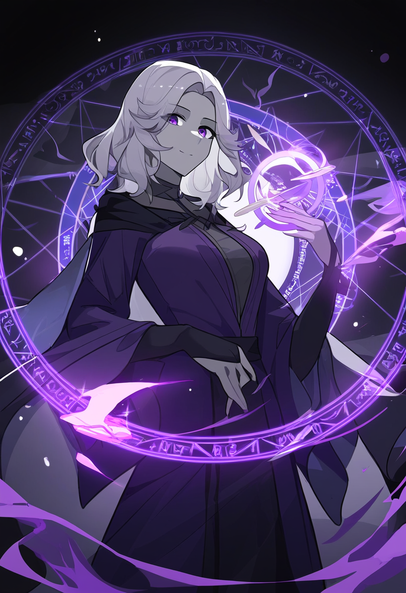

# Backstory

Growing up in Feyden, Laurathen Dhalmass often received comments about her race,
saying she couldn't be trusted with the important tasks around town, or even in
what little bit of a school there was. As she or her mom would walk around town,
there would always be stares and whispers behind their backs, even children
pointing. Between the shame of being singled out, and the anger she felt for the
injustice, Laurathen promised her parents that she would bring a good name to
their people and show just what they could achieve. She studied hard in school,
and dove into spell books, eventually feeling a draw to the weave and finding
that casting, surprisingly, came natural to her, once she knew what kind of
power to tap into.

With this newfound power, when she turned 18 she headed off to the big city of
Talis'Val to become a part of the court system, and worked her way up to being a
sternographer for the courts. Not a detail was missed, and she was reminded
every trial, every hearing, that she was to not speak a sound. And for quite a
few years, she complied without a single complaint. She made enough to get by
and enjoyed the work she did, and for a while, she felt like she really was
making a difference. However, eventually there was a trial brought up of another
drow, obviously down on his luck, accused of stealing from the baker's guild to
feed himself. He pleaded, begged, and tried to prove that he paid with what
little coin he had, but the jury turned a blind eye and he was sentenced to
prison. In a fit of injustice, Laurathen spoke up and out against the sentence,
trying to point back to the man's evidence, only for it to fall of deaf ears,
and for her position as sternographer to be questioned for such an outburst. The
next day, the man was still in a prison cell, and she was out of work.

Disgruntled with the current prejudice she faced, she vowed to make a name for
herself and for all drow, that they were dependable, hardworking, and mostly
honorable members of society, just like anyone else. And with that, she set off
to be an adventurer, using her magical talents to help those in the realm with
whatever task she could, so long as it was done correctly.

## Portrait

